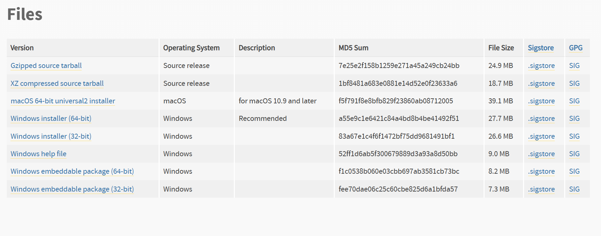

# 我最怕蛇了，但是Python，嘿嘿好用

最后编辑于 2025-10-30 by N0rth5ea

---


> Python 在近几年突飞猛进，已经成为最受欢迎的编程语言之一。它以简洁易读的语法、丰富的库和强大的社区支持，广泛应用于数据分析、人工智能、网络开发等领域。
> 在信息安全领域，Python 也展现出了强大的能力，成为渗透测试、漏洞分析和自动化任务的首选工具。

不多废话，直接开装，我不信你不需要用Python

!!! warning
    为了避免歧义，本文中 Python x.y.z 中的 x.y 表述为大版本号和小版本号，z 表述为补丁版本号。

## 第一步： 版本的选择
- Python 分两个大版本：Python 2 和 Python 3。Python 2 支持不多，且官方已经停止维护，建议直接使用 Python 3。
- 截止写本文时，Python 最新版本为 3.15.x，Python 每个小版本间都可能存在一些不兼容的改动。
- 常用且好用的版本有 3.8、3.10、3.12，第一次装可以装 3.10 各种项目兼容性较好。

## 第二步： 下载
- 访问 Python 官方网站 [https://www.python.org/downloads/](https://www.python.org/downloads/){target="_blank" rel="noopener"} 下载适合你操作系统的安装包。
- 当你想下载一个较旧的版本时，很可能点击该版本的下载链接后，只能看到源码(Source release)的下载选项。通常会有这样的描述`This is a security release of Python 3.10
  Note: The release you're looking at is Python 3.10.19, a security bugfix release for the legacy 3.10 series.`
- 往往这是因为该小版本已经进入"security fixes only"阶段，该补丁号版本只包含安全修复，不再提供二进制安装包。你需要在该页面找到类似下面这样一段话：
!!! quote
    According to the release calendar specified in PEP 619, Python 3.10 is now in the "security fixes only" stage of its life cycle: 3.10 branch only accepts security fixes and releases of those are made irregularly in source-only form until October 2026. Python 3.10 isn't receiving regular bug fixes anymore, and binary installers are no longer provided for it. Python 3.10.11 was the last full bugfix release of Python 3.10 with binary installers.
- 可以看出，3.10.11 是改小版本最后一个包含二进制安装包的补丁版本，你需要找到该版本号进入下载页面，找到适合你操作系统的安装包进行下载。

/// caption
正确的下载链接显示
///

## 第三步： 安装
- 建议勾选 Add Python x.y to PATH 选项，省的后续手动配环境变量。
- 我个人推荐一键安装而不是自定义安装，当然这也取决于个人习惯。

## 第四步： 验证安装与环境变量
- 打开命令行工具（Windows 按 徽标键 + R，输入 cmd 回车）
- 输入以下命令查看 Python 版本：
```bash
python --version
```
- 如果显示了你安装的 Python 版本号，说明安装成功且环境变量配置正确。
- 如果提示找不到命令，说明环境变量未配置成功，需要手动添加环境变量：
    1. 右键“此电脑”或“计算机”，选择“属性”。
    2. 点击“高级系统设置”，然后点击“环境变量”。
    3. 在“系统变量”中找到并选择“Path”，点击“编辑”（用户还是系统取决于个人习惯）。
    4. 点击“新建”，添加 Python 两个目录，默认位置为`C:\Users\你的用户名\AppData\Local\Programs\Python\Python3你的版本号\`
    5. 同时也新建`C:\Users\你的用户名\AppData\Local\Programs\Python\Python3你的版本号\Scripts\`。
    6. 点击“确定”保存更改，关闭所有窗口。
    7. 重新打开命令行工具，输入 `python --version` 再次验证。

!!! success
    恭喜你，Python 已经安装完了，但是你以为这就完了？
    Python 之所以好用，是因为它有丰富的第三方库。

## 第五步： 安装三方库
- 默认安装和自定义都默认勾选了 pip 安装，如果你在命令行输入 `pip --version` 能看到版本号，说明 pip 已经安装成功。
- 如果没有安装，请输入以下命令安装 pip：
```bash
python -m ensurepip --upgrade
```
- 安装第三方包的命令很简单，当你需要安装某个包时，只需运行以下命令：
```bash
pip install 包名
```
- 当一个项目会需要很多三方包时，通常会有一个 requirements.txt 文件，里面列出了所有需要安装的包及其版本号，你只需运行以下命令即可安装所有依赖：
```bash
pip install -r requirements.txt
```
- 配置 pip 镜像源。pip 官方源位于国外，在国内速度较慢，建议配置国内镜像源。可以通过以下命令临时使用清华镜像源安装包：
```bash
pip install 包名 -i https://pypi.tuna.tsinghua.edu.cn/simple
```
- 如果想永久配置镜像源，例如清华大学的镜像源，可以输入以下命令：
```bash
pip config set global.index-url https://pypi.tuna.tsinghua.edu.cn/simple
```
- 切回官方源：
```bash
pip config set global.index-url https://pypi.org/simple
```
??? note "更多国内源"
    清华源 https://pypi.tuna.tsinghua.edu.cn/simple</br>
    阿里源 https://mirrors.aliyun.com/pypi/simple/</br>
    腾讯源 http://mirrors.cloud.tencent.com/pypi/simple</br>
    豆瓣源 http://pypi.douban.com/simple/


## 第六步： 虚拟环境
- 当你用了一段时间 Python，你会发现不同项目对包的版本要求不一样，这时候虚拟环境就派上用场了。
- 虚拟环境有很多种选择，我个人喜欢使用 venv ，其他更高级的模块欢迎补充。
- 创建虚拟环境后，将会提供一个纯净的 Python 环境，当你下载三方包/运行项目时必须在激活虚拟环境状态，此时虚拟环境的三方库仅在该环境生效。
- 创建虚拟环境：
```bashnn
python -m venv myenv
```
- 激活虚拟环境：
=== "Windows"
    ```bash
    .\myenv\Scripts\activate
    ```
=== "Linux/macOS"
    ```bash
    source myenv/bin/activate
    ```
- 退出虚拟环境：
```bash
deactivate
```

!!! success
    至此，你已经学会了最基础的 Python 使用，好好享受与蛇共舞的时光吧！