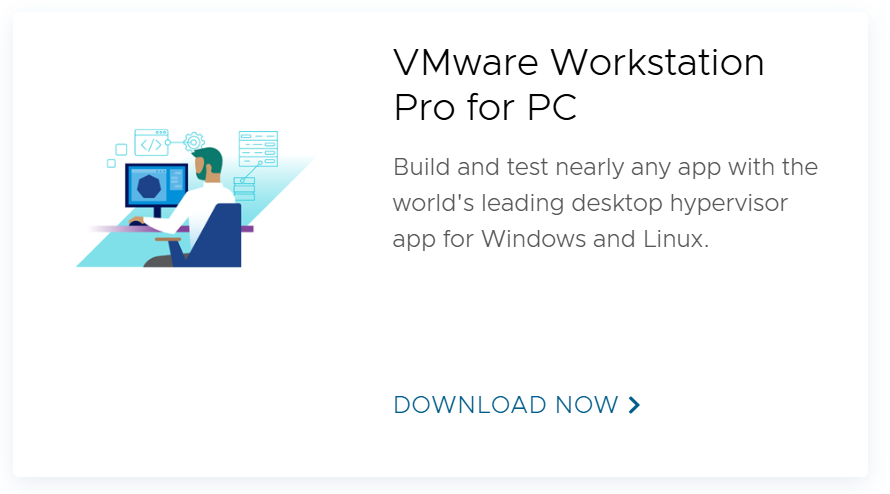
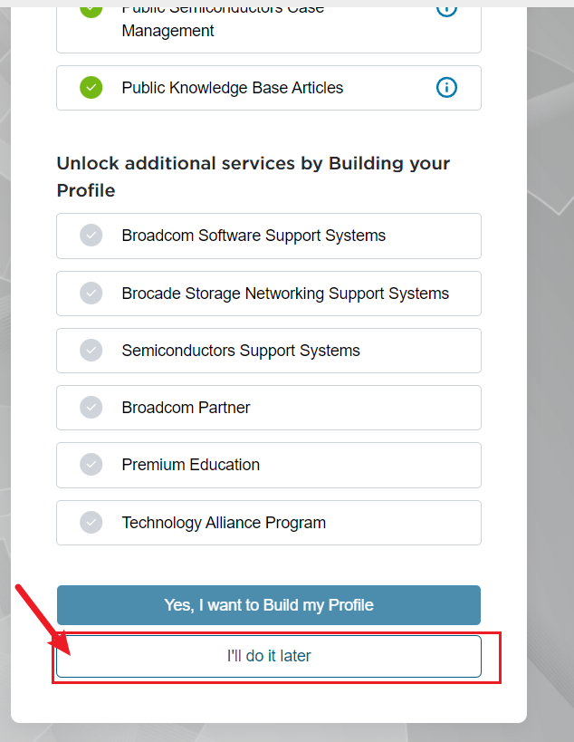
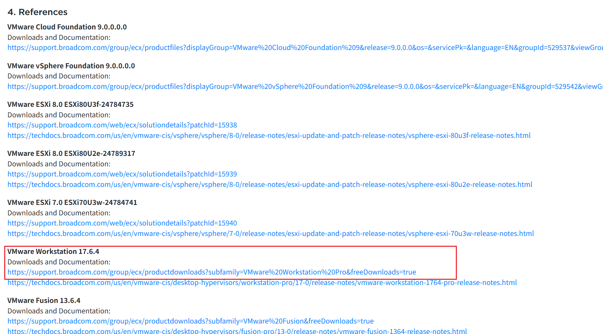

# VMWare Workstation Pro 17 安装与配置

---

最后更新于 2025-10-27 by N0rth5ea

!!! Warning "注意"
    VMWare Workstation Pro 个人非商业使用已免费提供，却有人花钱买盗版，别做大冤种哈。

??? note "参考文章"
    - [VMware Workstation Pro 17官网下载安装教程](https://blog.csdn.net/air__j/article/details/142798842){target="_blank"}
    - [VMware Workstation Pro 17 官网渠道下载安装教程](https://zhuanlan.zhihu.com/p/1937329854803603766){target="_blank"}
    - [Ubuntu安装步骤](https://zhuanlan.zhihu.com/p/684460783){target="_blank"}
    - [Kali安装步骤](https://blog.csdn.net/Zachyy/article/details/146372003){target="_blank"}

!!! note "什么是虚拟机，什么是VMWare，我到底在下什么"
    虚拟机（Virtual Machine，简称 VM）是一种通过软件模拟的计算机系统，它可以在一台物理计算机（称为宿主机）上运行一个或多个独立的操作系统环境（称为客户机）。每个虚拟机拥有自己的虚拟 CPU、内存、硬盘、网络接口等硬件资源，就像一台真实的计算机一样，但这些资源实际上是由宿主机的操作系统和虚拟化软件分配和管理的。虚拟机常用于开发测试、运行不同操作系统、隔离环境、学习网络安全技术等场景。
     VMware Workstation 是由 VMware 公司开发的一款运行在 Windows 或 Linux 系统上的桌面虚拟化软件。它允许用户在自己的电脑上创建和管理多个虚拟机，每个虚拟机可以安装不同的操作系统（如 Windows、Linux、甚至某些版本的 macOS），并支持快照、克隆、网络配置、共享文件夹等高级功能。对于网络安全学习者来说，VMware Workstation 常被用来搭建实验环境，比如运行靶机、测试恶意软件、练习渗透测试等，以确保操作不会影响到真实系统。
     所以，当你下载 VMware Workstation 时，你下载的是一个可以在你自己的电脑上创建和运行虚拟机的软件工具，而不是虚拟机本身。你需要另外准备操作系统的安装镜像（如 ISO 文件），然后在 VMware Workstation 中创建虚拟机并安装系统。
     by Qwen3-Max  
    因此显然你的VMWare应该下for windows版本（如果你的电脑是windows）

## VMWare Workstation Pro 17 下载安装

[直接下载链接，版本25H2，如果需要其他版本参见下方手动安装步骤](https://pan.baidu.com/s/1EojI9HYi8sE9gKQCkq9C-w?pwd=9d3p){target="_blank"}

??? note "手动安装"
    - 进入[VMWare 官网](https://www.vmware.com/){target="_blank"}
    
    - 搜索并选择`Fusion and Workstation`或直接点开[逃课-搜索结果](https://www.vmware.com/products/desktop-hypervisor/workstation-and-fusion){target="_blank"}
    
    - 选择VMware Workstation Pro for PC下载（点击Download Now）
    
        
    
    - 会跳转至broadcom网页，注册登录（注册在右上角切换，什么邮箱都行，补充信息地方选I'll do it later）。
    
        
        
    
    - 逃课方法：[不知道啥时候会过时的直链（也需要先登录）](https://support.broadcom.com/group/ecx/productdownloads?subfamily=VMware%20Workstation%20Pro&freeDownloads=true){target="_blank"}
    
    - 通用方法：在My Dashboard中搜索`VMware Workstation`，点开第一篇，向下翻到References，找到VMware Workstation，第一个链接即为下载链接
    
        
    
    - 一般下载最新版即可（这里可能有一个勾选框需要点进去看一下才能勾上，然后才能下载），版本号说明：25H2为25年下半年版本
    
    - 安装包直接安装即可，注意安装位置。

## 镜像文件下载

!!! note "什么是镜像文件"
    系统ISO镜像文件是一种包含完整光盘内容（如操作系统安装文件和引导信息）的单一文件，通常用于安装系统、软件分发或制作可启动U盘。
    by Qwen3-Max 
    如果你需要在VMWare里安装Kali，则你需要先下载Kali的ISO镜像文件，再通过VMWare挂载上去。

下载链接，无论什么系统，你的目标是一个iso文件，大小一般是几到十几GB:
=== "ubuntu 清华源镜像"
    [https://mirrors.tuna.tsinghua.edu.cn/ubuntu-releases/](https://mirrors.tuna.tsinghua.edu.cn/ubuntu-releases/){target="_blank"}
     比较好用的版本：2204、2404
=== "Kali 官方"
    [https://www.kali.org/get-kali/#kali-installer-images](https://www.kali.org/get-kali/#kali-installer-images){target="_blank"}

## 安装虚拟机

- 一般按教程装一两次后面就会装了，都是一步步走的傻瓜步骤
- [Ubuntu安装步骤](https://zhuanlan.zhihu.com/p/684460783){target="_blank"}
- [Kali安装步骤](https://blog.csdn.net/Zachyy/article/details/146372003){target="_blank"}
